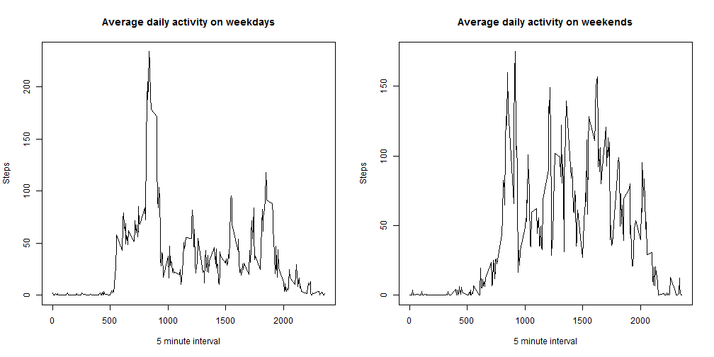

## Loading and preprocessing the data

Extract and load the data:


```r
if (!file.exists("activity.csv")) unzip("activity.zip")
x <- read.csv("activity.csv")
```

Clean the data and create aggregated information by date and interval:


```r
x_clean <- x[!is.na(x$steps),]
x_daily <- aggregate(x_clean$steps, by=list(Category=x_clean$date), FUN=sum)
x_interval <- aggregate(x_clean$steps, by=list(Category=x_clean$interval), FUN=mean)
```

## What is mean total number of steps taken per day?

Plot a histogram of steps per day:


```r
hist(as.numeric(x_daily$x), 
     main = "Steps per day", 
     xlab = "Steps",
     col = "red")
```

 

Calculate the mean and median steps:


```r
daily_mean <- mean(x_daily$x)
daily_median <- median(x_daily$x)
```

The mean number of steps per day is: **1.0766189 &times; 10<sup>4</sup>**

The median number of steps per day is: **10765**

## What is the average daily activity pattern?

Plot the average daily activity:


```r
plot(x_interval$Category, x_interval$x, 
     main = "Average daily activity", xlab = "5 minute interval", ylab = "Steps", type = "l")
```

 

Calculate the interval with the greatest average number of steps:


```r
int_max_index <- which.max(x_interval$x)
int_max_interval <- x_interval[int_max_index,1]
int_max_value <- x_interval[int_max_index,2]
```

The 5 minute interval with the largest average step count is **835**, with an average step count of **206.1698113**

## Imputing missing values

Calculate the total number of rows containing missing data:


```r
x_na <- x[is.na(x$steps),]
na_count <- nrow(x_na)
```

The number of missing rows is **2304**.

The strategy we will use to fill in the data is to replace all missing values with the average value for the corresponding 5 minute interval. 
We perform this task and store the result in x_imputed:


```r
for (ind in 1:na_count) {
	int_ind <- which(x_interval$Category == x_na[ind, 3])
	x_na[ind, 1] <- x_interval[int_ind, 2]
}
x_imputed <- rbind(x_clean, x_na)
x_imputed <- x_imputed[order(x_imputed[,2],x_imputed[,3]),]
```

Now we can plot another histogram showing the imputed data:


```r
x_daily_imp <- aggregate(x_imputed$steps, by=list(Category=x_imputed$date), FUN=sum)
hist(as.numeric(x_daily_imp$x), 
     main = "Steps per day (imputed data)", 
     xlab = "Steps",
     col = "blue")
```

 

The new mean and median:


```r
daily_mean_imp <- mean(x_daily_imp$x)
daily_median_imp <- median(x_daily_imp$x)
```

The new mean number of steps per day is **1.0766189 &times; 10<sup>4</sup>**, showing a change of **0**

The new median number of steps per day is: **1.0766189 &times; 10<sup>4</sup>**, showing a change of **1.1886792**

We see no change in the mean value, and a very small change in the median value. Interestingly, the median is now equal to the mean.
This can be explained by observing that in the original data set, the majority of missing (NA) values occurred in blocks of an entire day 
(possibly these missing days occurred when the recording device was not worn). This means that by filling in the missing data, we have 
added whole new days. These new days have a mean exactly equal to the mean calculated using the clean data previously, so they
do not change the calculated mean at all. Additionally, because there were a significant number of days added, it is not surprising
that one of these new days is now the median value, and thus the median is exactly equal to the mean.

## Are there differences in activity patterns between weekdays and weekends?

Determine which measurements occurred on weekdays and which on weekends, and add that information to the data frame.
Note that because our impute procedure did not account for weekday/weekend, we will use the clean, unimputed data.


```r
x_is_weekend <- weekdays(strptime(x_clean$date, "%Y-%m-%d")) %in% c("Saturday", "Sunday")
x_clean$day_type <- "weekday"
x_clean[x_is_weekend,]$day_type <- "weekend"
```

Now we can aggregate the data by interval and plot the results


```r
x_clean_weekday <- x_clean[x_clean$day_type == "weekday",]
x_clean_weekend <- x_clean[x_clean$day_type == "weekend",]
x_int_wday <- aggregate(x_clean_weekday$steps, by=list(Category=x_clean_weekday$interval), FUN=mean)
x_int_wend <- aggregate(x_clean_weekend$steps, by=list(Category=x_clean_weekend$interval), FUN=mean)
par(mfrow=c(1, 2))
plot(x_int_wday$Category, x_int_wday$x, 
     main = "Average daily activity on weekdays", xlab = "5 minute interval", ylab = "Steps", type = "l")
plot(x_int_wend$Category, x_int_wend$x, 
     main = "Average daily activity on weekends", xlab = "5 minute interval", ylab = "Steps", type = "l")
```

 

